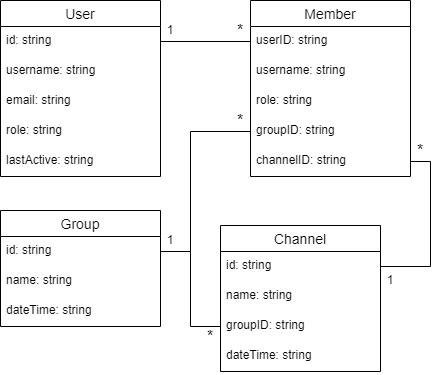

# Chatroom

## Introduction
This is a chat system built with the implementation of Angular framework as the frontend, NodeJS as the server (backend) and Bootstrap framework for the interface design. This chat system allows users to communicate with each other in real-time within different groups and channels. Users are assigned with different permission roles when accessing the application.

## Git
### Git Layout
The git repository contains the source code of the project and a documentation written as a README file. The src folder contains all resources of the Angular frontend system while the server folder contains the source code for the NodeJS server system. All codes are modified and commited on the master (default) branch.

### Version Control Approach
Whenever a feature or section of work is completed, codes are staged and commited to the local repository and are then pushed into the remote repository (GitHub). To keep track on the working progress, short message is included in each commit to provide brief explanation of the feature for better understanding.

Since this is an individual project, I didn't find it necessary to create branches as merge conflict is unlikely to happen during the development.

## Data Structure
There are four main data structures designed for this application. They are User, Group, Channel and Member.

The User object stores the information of an user. It contains an ID, username, email, role and a date when the user is last active on the site. User objects are stored in an array.

The Group object stores the information of a group. It contains an ID, name and the date the group is created. The Group objects are stored in an array.

The Channel object stores the information of a channel within a group. It has an ID, name, group ID to tell which group the channel is belonged to and the date the channel is created. All Channel objects are stored in an array.

The Member object tells the channel a user has access to. It contains the ID, username and role of the user in the particular group, and also the channel ID and group ID. The Member objects are stored in an array.

A group can have a set of channels while a channel must belong to only one group. A user can be a member of multiple channels and groups.

The diagram attached below shows the relationship between the entities.  

All data structures are stored on the server side in separate JSON files. These files are loaded on the server when the server program starts running. Data is collected as required and sent as a response to the frontend.

## REST API
### Auth Login
|  	|                                                         	|
|:----------------:	|--------------------------------------------------------------------------------------------------------------------------------------------------------------------------------------------------------------	|
|  **Description** 	| This route checks if user exists in the JSON data file. If it does, it allows the user to access the site. Otherwise, it returns an error response.                                                          	|
|     **Route**    	| /login                                                                                                                                                                                                       	|
|    **Method**    	| POST                                                                                                                                                                                                         	|
|  **Parameters**  	| username: string                                                                                                                                                                                             	|
| **Return Value** 	| If user valid:  `{user: User details, groups: Array of groups the user is in, channels: Array of channels the user is in, members: Array of combined data of the group and channel the user is a member of}` 	|

## Angular Architecture
## Components
### Login
This is the default route for the program. It consists of a login form with input fields for username and password, and a login button. When the login button is clicked, the program calls the login() function, which sends a HTTP POST request to "/login" route with the username in the server (Note that password authentication is not implemented at the moment). The server will check if the username received actually exists in the dummy data loaded from the JSON files. If the user is valid, the component will receive a response with user data which is then stored in the Local Storage. The application will then navigate the user to the Account route.

If the user is invalid, the application will receive a negative response. This will trigger the local error variable which then cause an error message to be shown on the frontend.

### Account
This is the route the application will navigate the user to after gaining permission to access the site. The route takes the user ID as the query parameter. 

Once the component is successfully rendered and loaded on the page, the application will first retrieve data from the Local Storage for later access. The page displayed on the frontend consists of a section to display some basic user information and also a section to list out the groups that the user has joined. Specific features or buttons are displayed based on the role of the current user.

The table below provides brief explanation of each option and the permission role a user should have to access them.
| Feature/Button 	| Explanation                                                                                                                                                                                                                                	|         Permission Role        	|   	|   	|
|:-------------:	|--------------------------------------------------------------------------------------------------------------------------------------------------------------------------------------------------------------------------------------------	|:------------------------------:	|---	|---	|
|     Logout    	| Logout and exit from the application. User is redirected back to the login page.                                                                                                                                                           	|               ALL              	|   	|   	|
|  Create Group 	| Open a modal that consists of input form to create a new group.                                                                                                                                                                            	| - Super Admin - Group Admin 	|   	|   	|
|   Admin Work  	| Displayed as a gear/setting button. Open a modal that consists of options to create new user, create new group or change the role of a user.                                                                                               	| - Super Admin - Group Admin 	|   	|   	|
|     Group     	| When cursor is hover to a particular group, a dropdown list of channels is displayed. User can select one of them to navigate to the Channel Route. Clicking on the group will open a modal that displays the information of the group. 	|               ALL              	|   	|   	|

  
### Channel
This is the route that brings user to the channel room. This route takes two query arguments, the group ID and the channel ID. 

The component consists of three sections. A channel panel to list out the channels within the group which the user are given permission to access to, a chatting section to send message and communicate in the channel, and a member list to display all members in the group. There are extra features which are available only to users with specific roles.

|  Option/Button 	| Explanation                                                                                                                                                                                                                                             	|                                                          Permission Role                                                          	|
|:--------------:	|---------------------------------------------------------------------------------------------------------------------------------------------------------------------------------------------------------------------------------------------------------	|:---------------------------------------------------------------------------------------------------------------------------------:	|
|      Leave     	| Clicking on the button will get user out of the Channel Room and redirect back to the Account route.                                                                                                                                                    	|                                                                ALL                                                                	|
| Delete Channel 	| Clicking on this button will delete the channel the user currently join.                                                                                                                                                                                	|                                                   - Super Admin - Group Admin                                                  	|
|   Delete User  	| When the cursor hovers over the username in the member list, a bin button appears beside the username. Clicking on the button will display a dropdown list which user can choose to either delete the selected used from the channel or from the group. 	| - Super Admin can remove any user - Group Admin can remove Group Assis and normal user - Group Assis can remove normal user 	|
|  Send Message  	| Non-functionable                                                                                                                                                                                                                                        	|                                                                ALL                                                                	|

  
## Modal
A modal is implemented as a popup dialog that allows several features such as creating a new user, adding a member to a channel etc. The modal is triggered by interacting with the buttons rendered in the Account page.

The table below provides description of the each feature shown in the modal and their respective functionalities.

|        Modal        	| Description                                                                                                                                                                                                                                                                                                                                                                                                                                        	| Feature/Button                                                                                                                                                                                                                                                                                                                                                                                                                                                                                                                                                                                                                                                                                                                                                  	|                 Permission Role                 	|
|:-------------------:	|----------------------------------------------------------------------------------------------------------------------------------------------------------------------------------------------------------------------------------------------------------------------------------------------------------------------------------------------------------------------------------------------------------------------------------------------------	|-----------------------------------------------------------------------------------------------------------------------------------------------------------------------------------------------------------------------------------------------------------------------------------------------------------------------------------------------------------------------------------------------------------------------------------------------------------------------------------------------------------------------------------------------------------------------------------------------------------------------------------------------------------------------------------------------------------------------------------------------------------------	|:-----------------------------------------------:	|
|    Group Details    	| Display information of the group and list out the channels available for the user to join when user clicks on the group icon in the Account page.                                                                                                                                                                                                                                                                                                  	| Join Channel - User selects on a channel and click on the Join Channel button to navigate to the specific channel room.  Delete Channel - Available to Super Admin and Group Admin. User select a channel and click on the Delete Channel button to delete the channel.  Create Channel - Available to Super Admin, Group Admin and Group Assis. Clicking on button changes the display of the modal to the Create Channel form.  Add Member - Available to Super Admin, Group Admin and Group Assis. User select a channel and click on the button to change the display of the modal to the Add Member Form.  Delete Group - Available to Super Admin and Group Admin. Clicking on the button deletes the group and closes the modal. 	|                       ALL                       	|
| Create Channel Form 	| Display input form to create a new channel within the group. User can also add members while creating the channel.  Super Admin and Group Admin can add any user into the new channel while Group Assis can only add member within the group into the new channel.                                                                                                                                                                           	| Add Button - Add user into the channel if the username entered is valid. Otherwise, display error message for invalid user.  Create - Create new channel and add listed members into the new channel after making sure the name of the new channel is valid. Otherwise, display error message.                                                                                                                                                                                                                                                                                                                                                                                                                                                            	| - Super Admin - Group Admin - Group Assis 	|
|   Add Member Form   	| Display input form to add member into selected channel. User enters username into the input field and click on the Add button. The application will check if the username entered is valid. If yes, the username will be displayed as a list below the form.  Multiple members can be added. Super Admin and Group Admin can add any user into the selected channel while Group Assis can only add member within the group into the channel. 	| Add Button - Add user into the list if the username entered is valid. Otherwise, display error message.  Add Member - Add list of users into the selected channel.                                                                                                                                                                                                                                                                                                                                                                                                                                                                                                                                                                                        	| - Super Admin - Group Admin - Group Assis 	|
|  Create Group Form  	| Display input form to create a new group. User needs to fill in the input form with the group name. The group must not have the same name as the existing groups.  User can also create new channels in the group. The channel names within the group cannot be repeated.  Error message will be displayed if the input entered is invalid.                                                                                            	| Add Button - Add channel into the list of new channels  Create - Create the group and the channels within the group                                                                                                                                                                                                                                                                                                                                                                                                                                                                                                                                                                                                                                       	|          - Super Admin - Group Admin         	|
|      Admin Work     	| It consists of three input forms in accordion:  - Create new user: Need username, email and role in the input form. Username must not be same as existing usernames. Otherwise, an error message will be displayed.  - Create new group: Functions the same as the Create Group Form  - Change user role: Enter username of user and select a new role for the user.`                                                            	| N/A                                                                                                                                                                                                                                                                                                                                                                                                                                                                                                                                                                                                                                                                                                                                                             	|          - Super Admin - Group Admin         	|

## Author
---------------
Ler Theng Loo (s5212872)    
3813ICT Software Frameworks    
Griffith Univeristy    
